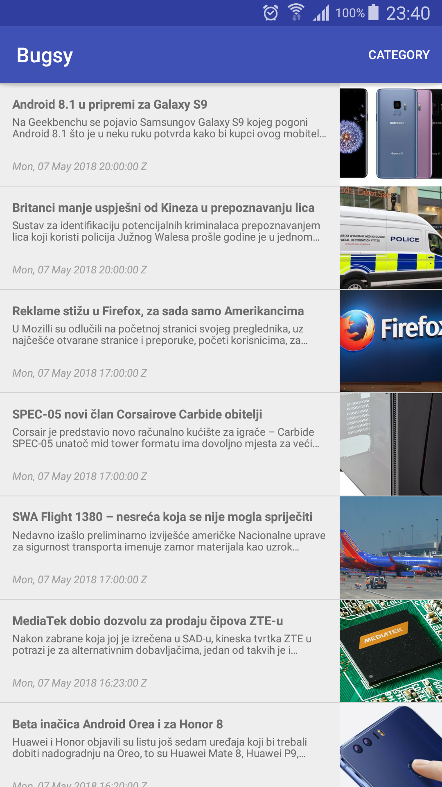
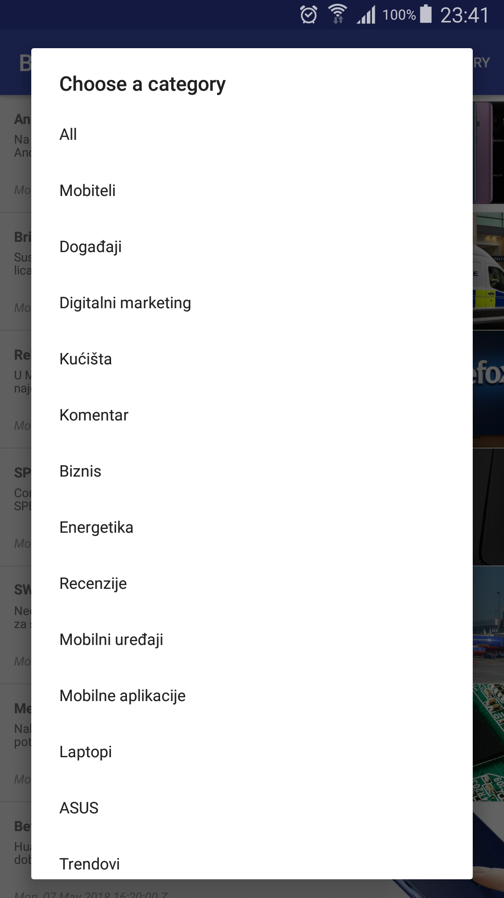
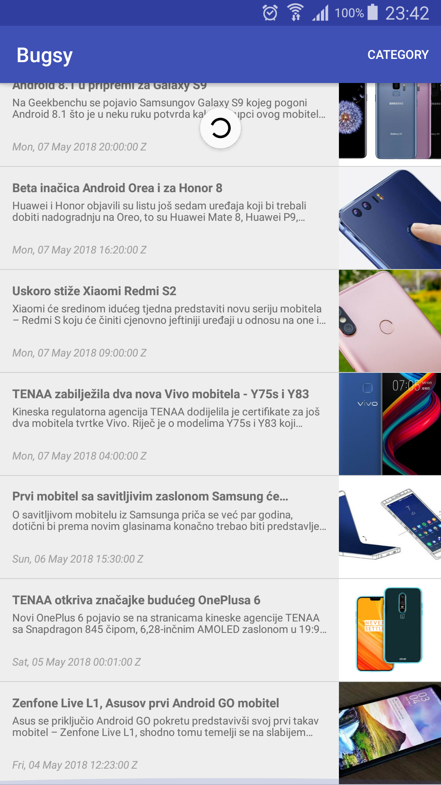
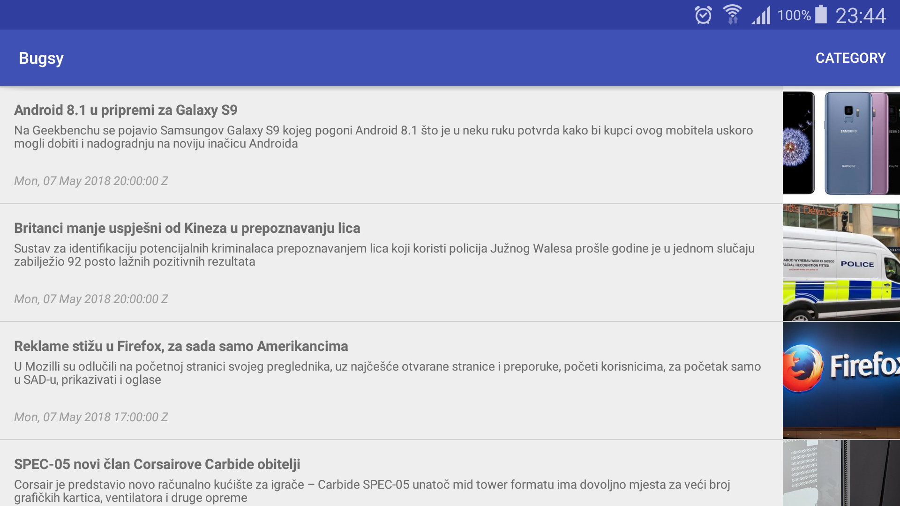

# Homework: Bugsy

### The assignment and problems encountered

The task of this assignment was to create an application which loads an RSS feed from (here)[https://www.bug.hr/rss]. It should show each post's image, title, description, date posted and allow loading complete articles by clicking on one of them.

### Utilised snippets/solutions/libraries/SO answers

* https://material.io/guidelines/style/color.html 
* https://material.io/guidelines/style/typography.html
* https://futurestud.io/tutorials/retrofit-how-to-integrate-xml-converter
* https://stackoverflow.com/questions/25380280/how-to-use-retrofit-and-simplexml-together-in-downloading-and-parsing-an-xml-fil
* https://stackoverflow.com/questions/3920602/get-specific-arraylist-item
* https://stackoverflow.com/questions/7470992/exception-with-simple-xml-framework-deserialization
* http://www.vogella.com/tutorials/Retrofit/article.html
* http://www.vogella.com/tutorials/AndroidActionBar/article.html
* https://developer.android.com/training/swipe/add-swipe-interface
* https://developer.android.com/training/swipe/respond-refresh-request
* https://gist.github.com/antoniolg/9837398
* https://zeroturnaround.com/rebellabs/getting-started-with-retrofit-2/
* https://stackoverflow.com/questions/31627073/why-does-onclicklistener-on-a-viewholder-dont-work
* https://stackoverflow.com/questions/15762905/how-can-i-display-a-list-view-in-an-android-alert-dialog
* https://stackoverflow.com/questions/4404084/check-if-a-value-exists-in-arraylist

### Screenshots

Samsung Galaxy Note 3 (SM-N900) running Lollipop (5.0)

    

### Bottom line
Turns out there is no way to use a SwipeRefreshLayout with ButterKnife, or at least it wasn't easily available on the Internet.